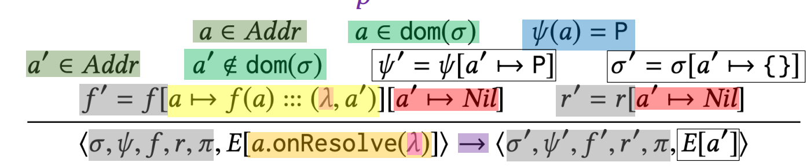

## Promise Semantics: Exercise 2



```
A. This rule handles the case when a pending promise is resolved.
B. This rule causes one promise to be “linked” to another.
C. This rule handles the case when a fulfill reaction is registered on a promise that is already resolved.
D. This rule registers a fulfill reaction on a pending promise.
E. None of the above. Describe what does the promise do.
```

<details>
<summary> Solution: </summary>
    D.
</details>