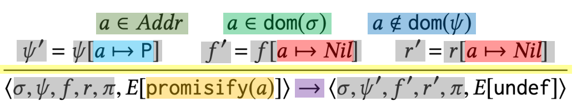
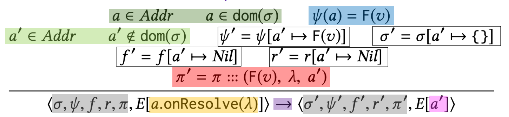
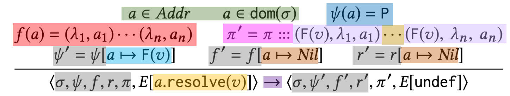
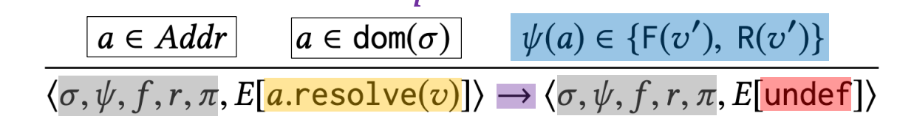
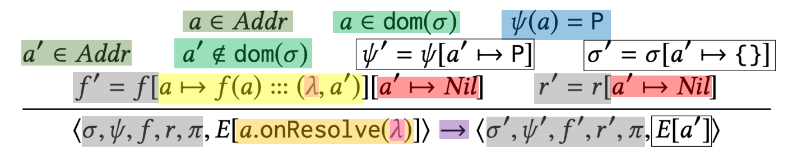

## Promise Semantics: Exercise 4

### Select the correct rule:
This rule handles the case when a fulfill reaction is registered on a promise that is already resolved.

A. 
B. 
C. 
D. 
E. 

 Solution: 

    B.

