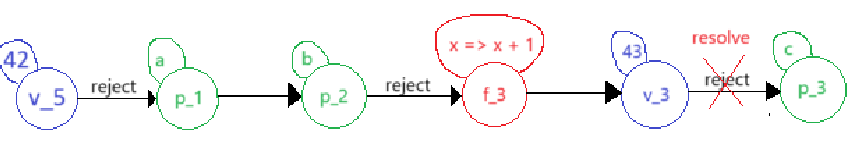
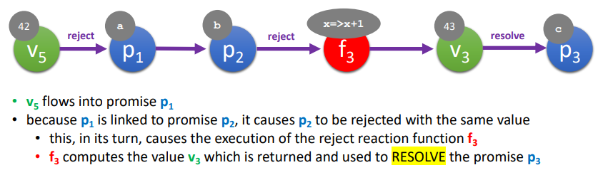

# Promise Graph exercise 1:
```
1:   var a = promisify({});
2:   var b = promisify({});
3:   var c = b.onReject(x => x + 1);
4:   a.link(b);
5:   a.reject(42);
```

### My answer: 


### Solution corrected


