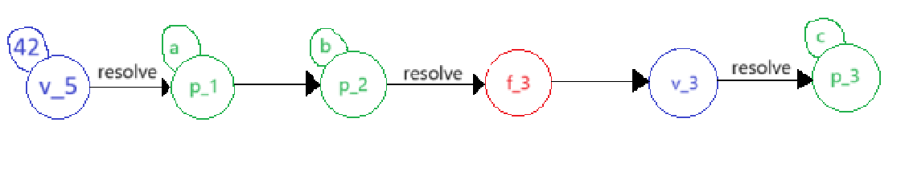
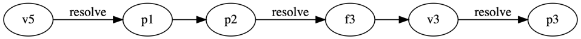

# Promise Graph exercise 1:
```
1:    var a = promisify({}); 
2:    var b = promisify({}); 
3:    var c = b.onResolve(...); 
4:    a.link(b); // 
5:    a.resolve(42); 
```

### My answer: 


### Solution corrected


